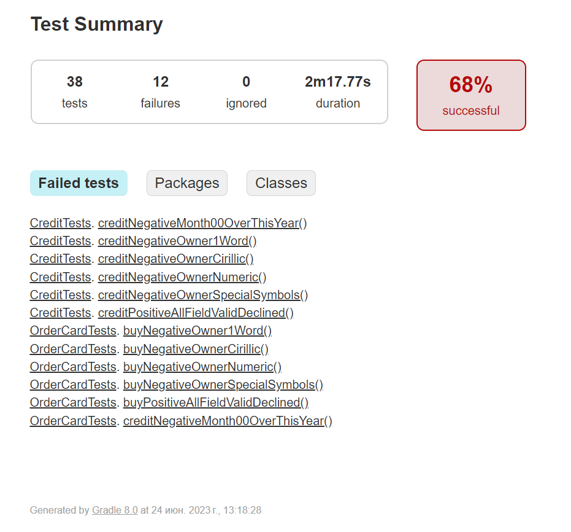

# Отчёт о проведённом тестировании
### Краткое описание
Проведено тестирование веб-сервиса по покупке тура. Все тестовые сценарии автоматизированы. Проверены два варианта оплаты:
- по дебетовой карте (Купить)
- по кредитной карте (Купить в кредит)

Автоматизированные тесты были успешно запущены для двух СУБД:
- MySQL
- PostgreSQL

Всего составлено 38 тестов, из них:
- Успешных - 26 (68.42)
- Неуспешных - 12 (31.58)
- Проигнорировано: 0

#### Отчет по результатам тестирования Gradle:

Отчёт Test Summary. Failed Tests:

Отчёт Test Summary. Classes:

#### Отчет по результатам тестирования Allure:
Отчёт Overview:

Отчёт Suites. CreditPage:

Отчёт Suites. PaymentTest:

### Общие рекомендации

**Общие рекомендации**:
* Исправить найденные баги
* Добавить сообщения об ошибках на более информативные, указывающие в чем конкретно ошибка